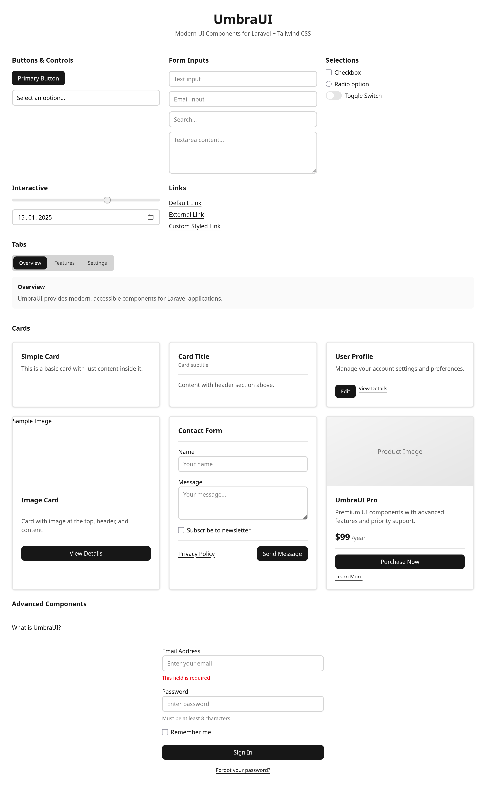

  <p align="center">
  
</p>

<h1 align="center">UmbraUI</h1>

<p align="center">
  <a href="https://packagist.org/packages/ihxnnxs/umbra-ui"></a>
  <a href="https://github.com/ihxnnxs/UmbraUI/actions?query=workflow%3Arun-tests+branch%3Amain"></a>
  <a href="https://github.com/ihxnnxs/UmbraUI/actions?query=workflow%3A%22Fix+PHP+code+style+issues%22+branch%3Amain"></a>
  <a href="https://packagist.org/packages/ihxnnxs/umbra-ui"></a>
</p>

**Essential UI components library for Laravel applications with Tailwind CSS**

<p align="center">
  
  
</p>

UmbraUI focuses on providing the most essential UI components for modern web applications. Built with
accessibility-first design, dark/light theme support, and seamless Laravel integration.

## Essential Components

UmbraUI focuses on the most critical components for modern web applications, based on industry standards and popular
libraries like shadcn/ui, Tailwind UI, and Chakra UI.

### Core Form Components ✅

| Component   | Status  | Description                            |
|-------------|---------|----------------------------------------|
| Button      | ✅ Ready | Primary, secondary, and variant styles |
| Input       | ✅ Ready | Text, email, password, number inputs   |
| Link        | ✅ Ready | Styled anchor elements                 |
| Textarea    | ✅ Ready | Multi-line text input                  |
| Select      | ✅ Ready | Dropdown selection                     |
| Checkbox    | ✅ Ready | Boolean selection                      |
| Radio       | ✅ Ready | Single choice selection                |
| Label       | ✅ Ready | Form field labels                      |
| Field       | ✅ Ready | Form field wrapper with validation     |
| Switch      | ✅ Ready | Toggle switch                          |
| Slider      | ✅ Ready | Range input                            |
| Date Picker | ✅ Ready | Date selection                         |

### Navigation & Layout ✅

| Component | Status  | Description                        |
|-----------|---------|------------------------------------|
| Alert     | ✅ Ready | Success, error, warning, info      |
| Badge     | ✅ Ready | Status indicators and labels       |
| Avatar    | ✅ Ready | User profile pictures and initials |
| Tabs      | ✅ Ready | Tabbed navigation interface        |
| Accordion | ✅ Ready | Collapsible content sections       |
| Modal     | ✅ Ready | Dialog/popup overlay               |
| Card      | ✅ Ready | Universal card with image support  |
| Dropdown  | ✅ Ready | Context menus with nested submenus |

### Coming Next 🚀

| Component | Status        | Priority | Target |
|-----------|---------------|----------|--------|
| Toast     | 🚧 Developing | High     | V0.2   |
| Tooltip   | ⏳ Planned     | High     | V0.2   |
| Table     | ⏳ Planned     | High     | V0.2   |
| Spinner   | ⏳ Planned     | Medium   | V0.2   |

## Installation

You can install the package via composer:

```bash
composer require ihxnnxs/umbra-ui
```

## Usage

### Basic Components

```blade
{{-- Buttons --}}
<x-umbra-ui::button>Primary Button</x-umbra-ui::button>
<x-umbra-ui::button type="submit" class="bg-blue-600">Custom Button</x-umbra-ui::button>

{{-- Form Inputs --}}
<x-umbra-ui::input type="email" placeholder="Enter email" />
<x-umbra-ui::textarea placeholder="Your message..." />
<x-umbra-ui::select>
    <option>Choose...</option>
    <option value="1">Option 1</option>
</x-umbra-ui::select>

{{-- Form Controls --}}
<x-umbra-ui::checkbox id="terms" />
<x-umbra-ui::label for="terms">Accept Terms</x-umbra-ui::label>

<x-umbra-ui::radio name="choice" value="a" id="choice-a" />
<x-umbra-ui::label for="choice-a">Choice A</x-umbra-ui::label>

<x-umbra-ui::switch id="notifications" />
```

### Advanced Components

```blade
{{-- Form Fields with Validation --}}
<x-field label="Email Address" error="Email is required">
    <x-input type="email" />
</x-field>

<x-field label="Message" helper="Maximum 500 characters">
    <x-textarea />
</x-field>

{{-- Navigation --}}
<x-tabs default-tab="overview">
    <x-tabs.nav>
        <x-tabs.tab value="overview">Overview</x-tabs.tab>
        <x-tabs.tab value="settings">Settings</x-tabs.tab>
    </x-tabs.nav>
    
    <x-tabs.panel value="overview">
        <p>Overview content...</p>
    </x-tabs.panel>
    
    <x-tabs.panel value="settings">
        <p>Settings content...</p>
    </x-tabs.panel>
</x-tabs>

{{-- Badges --}}
<x-umbra-ui::badge>Default</x-umbra-ui::badge>
<x-umbra-ui::badge variant="success">Success</x-umbra-ui::badge>
<x-umbra-ui::badge variant="error" removable="true">Removable</x-umbra-ui::badge>
<x-umbra-ui::badge variant="primary" dot="true">With Dot</x-umbra-ui::badge>
<x-umbra-ui::badge size="lg">Large Badge</x-umbra-ui::badge>

{{-- Avatars --}}
<x-umbra-ui::avatar src="/path/to/image.jpg" alt="User Name" />
<x-umbra-ui::avatar initials="JD" size="lg" />
<x-umbra-ui::avatar status="online" size="md" />
<x-umbra-ui::avatar shape="square" initials="AB" />

{{-- Interactive Components --}}
<x-accordion>
    <x-slot name="title">FAQ Item</x-slot>
    Answer content goes here...
</x-accordion>

<x-slider min="0" max="100" value="50" />
<x-date-picker value="2025-01-15" />
```

### Cards

```blade
{{-- Simple Card --}}
<x-card>
    <h4>Card Title</h4>
    <p>Card content goes here...</p>
</x-card>

{{-- Card with Image --}}
<x-card>
    <x-slot name="image">
        
    </x-slot>
    
    <x-slot name="header">
        <h4>Card with Image</h4>
    </x-slot>
    
    <p>Content with image and header.</p>
    
    <x-slot name="footer">
        <x-button>Action</x-button>
    </x-slot>
</x-card>
```

### Links

```blade
<x-link href="https://example.com">External Link</x-link>
<x-link href="/dashboard" class="text-blue-600">Custom Styled Link</x-link>
```

## Testing

```bash
composer test
```

## Changelog

Please see [CHANGELOG](CHANGELOG.md) for more information on what has changed recently.

## Contributing

Please see [CONTRIBUTING](CONTRIBUTING.md) for details.

## Security Vulnerabilities

Please review [our security policy](../../security/policy) on how to report security vulnerabilities.

## Credits

- [ihxnnxs](https://github.com/ihxnnxs)
- [All Contributors](../../contributors)

## License

The MIT License (MIT). Please see [License File](LICENSE.md) for more information.
